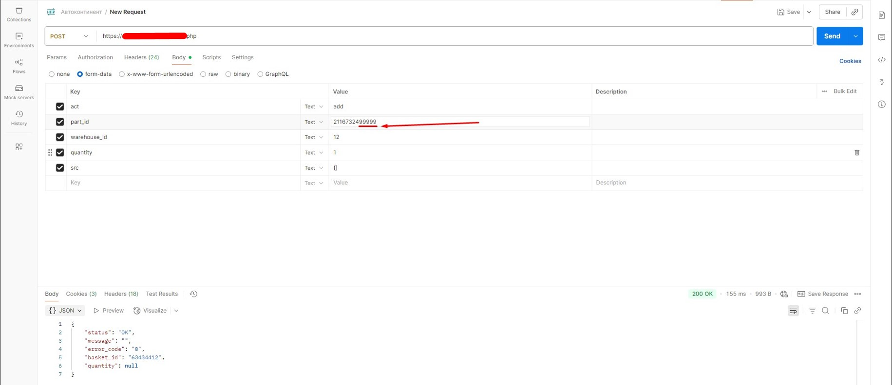
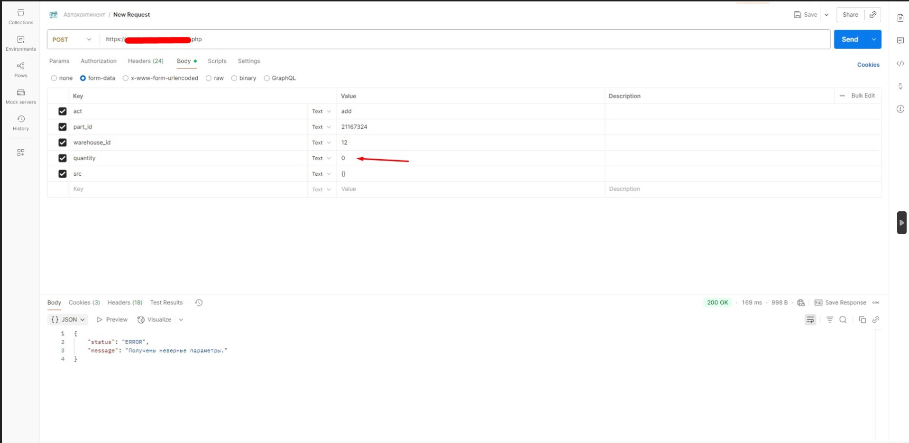
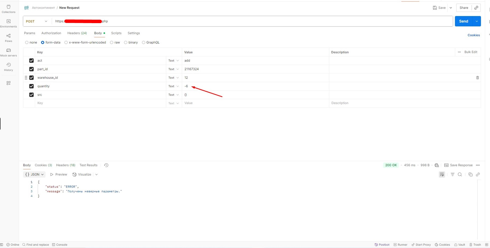
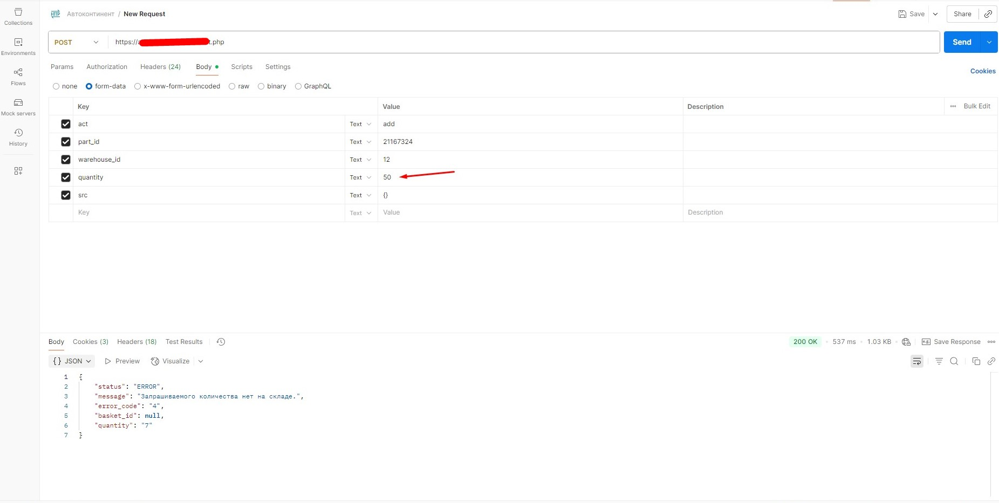
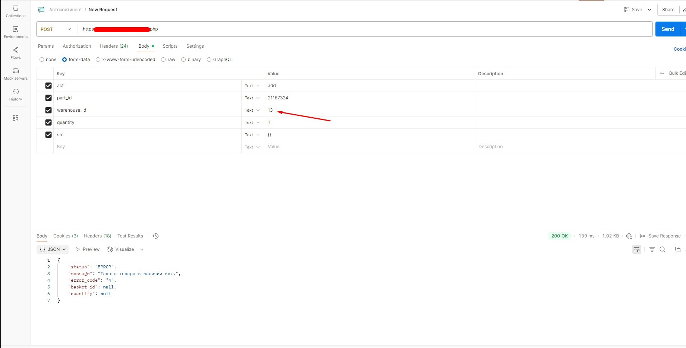
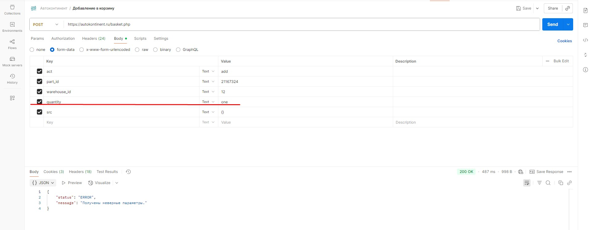
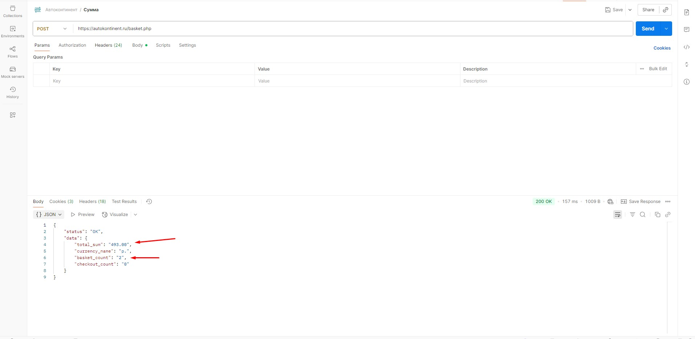
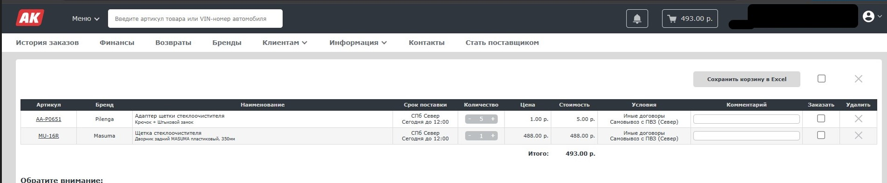
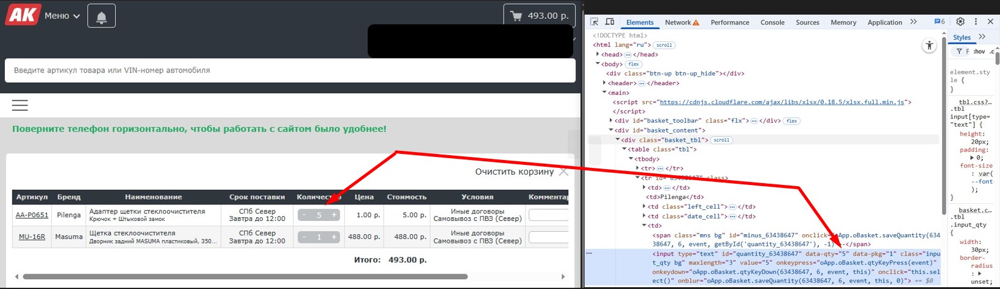

# Тестирование API добавления товара в корзину

## 📋 Общая информация
**Объект тестирования:** API метода добавления товара в корзину  
**Окружение:** Production/Staging  
**Предусловие:** Пользователь авторизован в системе. Получен валидный токен авторизации.

---

## ✅ Позитивные сценарии

### **Тест-кейс ID: API-001**
**Название:** Успешное добавление товара в корзину  
**Приоритет:** High   
**Предусловие:** Корзина пользователя пуста.  
**Шаги:**
1. Отправить POST-запрос  с валидными параметрами:
   - `part_id` = 21167324
   - `quantity` = 1
   - `warehouse_id` = 12
2. Проверить ответ сервера.

**Ожидаемый результат:**
- Status: `200 OK`
- Тело ответа (JSON):
```json
{
    "status": "OK",
    "message": "",
    "error_code": "0",
    "basket_id": "63438647",
    "quantity": null
}
```

---

### **Тест-кейс ID: API-002**
**Название:** Проверка корректного расчета суммы и количества товаров  
**Приоритет:** High  
**Предусловие:** Корзина пользователя пуста.  
**Шаги:**
1. Добавить товар A (ID: 21167324, цена: 1.00 р., количество: 1 шт.)
2. Добавить товар B (ID: 39617892, цена: 100.00 р., количество: 2 шт.)
3. Отправить POST-запрос

**Ожидаемый результат:**
- Status: `200 OK`
- Тело ответа содержит:
```json
{
    "status": "OK",
    "data": {
        "total_sum": "201.00",
        "currency_name": "р.",
        "basket_count": "2",
        "checkout_count": "0"
    }
}

```


---

## ❌ Негативные сценарии

### **Тест-кейс ID: API-101**

**Название:** Добавление несуществующего товара  
**Приоритет:** Medium  
**Предусловие:** Корзина пользователя пуста.  
**Шаги:**  
1. Отправить запрос с невалидным `part_id = 2116732499999`

**Ожидаемый результат:**
- Status: `200 OK`
- Ответ:
```json
{
    "status": "ERROR",
    "message": "Получены неверные параметры."
}
```

---

### **Тест-кейс ID: API-102**
**Название:** Добавление нулевого количества товара  
**Приоритет:** Medium  
**Предусловие:** Корзина пользователя пуста.  
**Шаги:**  
1. Указать валидный `part_id = 21167324`
2. Указать `quantity = 0`
3. Отправить POST-запрос

**Ожидаемый результат:**
- Status: `200 OK`
- Ответ:
```json
{
    "status": "ERROR",
    "message": "Получены неверные параметры."
}
```

---

### **Тест-кейс ID: API-103**
**Название:** Добавление отрицательного количества  
**Приоритет:** Medium  
**Предусловие:** Корзина пользователя пуста.  
**Шаги:**  
1. Указать валидный `part_id = 21167324`
2. Указать `quantity = -6`
3. Отправить POST-запрос

**Ожидаемый результат:**
- Status: `200 OK`
- Ответ:
```json
{
    "status": "ERROR", 
    "message": "Получены неверные параметры."
}
```

---

### **Тест-кейс ID: API-104**
**Название:** Превышение лимита количества на складе  
**Приоритет:** Medium  
**Предусловие:** Корзина пользователя пуста.  
**Шаги:**  
1. Указать валидный `part_id = 21167324`
2. Указать `quantity = 50`
3. Отправить POST-запрос

**Ожидаемый результат:**
- Status: `200 OK`
- Ответ:
```json
{
    "status": "ERROR",
    "message": "Запрашиваемого количества нет на складе.",
    "error_code": "4",
    "basket_id": null,
    "quantity": "7"
}
```

---

### **Тест-кейс ID: API-105**
**Название:** Указание несуществующего склада  
**Приоритет:** Medium  
**Предусловие:** Корзина пользователя пуста.  
**Шаги:**  
1. Указать валидный `part_id = 21167324`
2. Указать не существующий склад `warehouse_id = 13`
3. Отправить POST-запрос

**Ожидаемый результат:**
- Status: `200 OK`
- Ответ:
```json
{
    "status": "ERROR",
    "message": "Такого товара в наличии нет.",
    "error_code": "4",
    "basket_id": null,
    "quantity": null
}
```

---

### **Тест-кейс ID: API-106**
**Название:** Передача нечислового значения в quantity  
**Приоритет:** Medium  
**Предусловие:** Корзина пользователя пуста.  
**Шаги:**  
1. Указать валидный `part_id = 21167324`
2. Указать `quantity = "one"`
3. Отправить POST-запрос

**Ожидаемый результат:**
- Status: `200 OK`
- Ответ:
```json
{
    "status": "ERROR",
    "message": "Получены неверные параметры."
}
```




---

##  UI-тестирование (интеграционное)

### **Тест-кейс ID: UI-001**
**Название:** Проверка отображения количества и суммы товаров в корзине  
**Приоритет:** High  
**Предусловие:** Корзина пользователя пуста.
**Шаги:**
1. Добавить товар A (ID: 21167324, цена: 1.00 р., количество: 1 шт.)
2. Добавить товар B (ID: 39617892, цена: 100.00 р., количество: 2 шт.)
3. Открыть страницу корзины в UI
4. Сверить количество  и сумму товаров 

**Ожидаемый результат:**
Значение  соответствует количеству и сумме добавленному через API.


-------------------------------------------------------------------------------------

-------------------------------------------------------------------------------------

---


##  Примечания
- Все тесты выполняются с предварительной авторизацией


